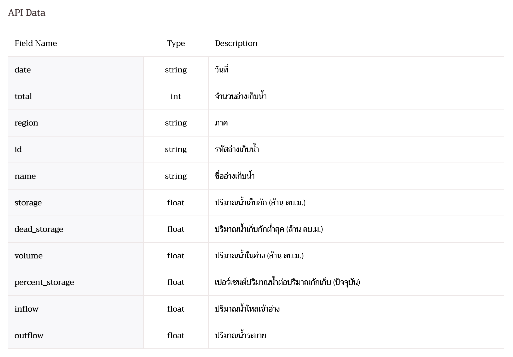

# Thailand Reservoir Dashboard — v0.0.2

A web dashboard that shows how much water is in Thailand's reservoirs, using public data from the **Royal Irrigation Department (RID / กรมชลประทาน)**.

For a detailed explanation of how the system works (in Thai), see [docs/](docs/README.md).

---

## 1. Scope

### In scope (v0.0.2)
- Fetch the latest daily reservoir data from the RID public API.
- A dashboard that shows:
  - National summary KPIs.
  - A comparison of the regions (ภาค).
  - How many reservoirs fall in each water-status band.
  - A searchable, filterable, sortable table of all reservoirs.
  - A detail view for each reservoir.
- Show the data date (`date`) and when the data was last fetched.
- Run the whole stack with Docker Compose.

### Out of scope (v0.0.2)
- Maps of any kind (2D or 3D). The RID API has no coordinates (see §2.4).
- Historical / time-series data. The API returns only the latest day.
- User accounts and authentication.

---

## 2. Data Source

### 2.1 Endpoints

| Purpose | URL |
|---|---|
| API documentation | https://app.rid.go.th/reservoir/api/document/reservoir |
| Data endpoint (JSON) | https://app.rid.go.th/reservoir/api/reservoir/public |

- Method: `GET`, no authentication.
- The browser **never** calls RID directly. Only the backend calls RID. This avoids CORS problems and avoids calling RID on every page load (see §4).

### 2.2 Response schema

Top level:

| Field | Type | Description |
|---|---|---|
| `document` | string | URL of the API documentation |
| `date` | string (`YYYY-MM-DD`) | วันที่ของข้อมูล (data date) |
| `total` | int | จำนวนอ่างเก็บน้ำ (number of reservoirs) |
| `data` | array of Region | Reservoirs grouped by region |

Region:

| Field | Type | Description |
|---|---|---|
| `region` | string | ภาค (region name, Thai) |
| `reservoir` | array of Reservoir | Reservoirs in this region |

Reservoir:

| Field | Type | Unit | Description |
|---|---|---|---|
| `id` | string | – | รหัสอ่างเก็บน้ำ, e.g. `rsv01` |
| `name` | string | – | ชื่ออ่างเก็บน้ำ |
| `storage` | float | million m³ (ล้าน ลบ.ม.) | ปริมาณน้ำเก็บกัก (capacity) |
| `dead_storage` | float | million m³ | ปริมาณน้ำเก็บกักต่ำสุด (dead storage) |
| `volume` | float \| **null** | million m³ | ปริมาณน้ำในอ่าง (current volume) |
| `percent_storage` | float \| null | % | `volume / storage × 100` |
| `inflow` | float \| **null** | million m³ ⚠️ | ปริมาณน้ำไหลเข้าอ่าง |
| `outflow` | float \| **null** | million m³ ⚠️ | ปริมาณน้ำระบาย |

⚠️ RID does not document the time unit for `inflow` / `outflow`. It is probably per day. Confirm with RID before the UI shows a unit.

Original metadata from RID:



### 2.3 Example response (trimmed; data from 2026-10-03)

```json
{
  "document": "https://app.rid.go.th/reservoir/api/document/reservoir",
  "date": "2026-10-03",
  "total": 461,
  "data": [
    {
      "region": "ภาคเหนือ",
      "reservoir": [
        {
          "id": "rsv01",
          "name": "อ่างเก็บน้ำห้วยแม่ออน",
          "storage": 4.53,
          "dead_storage": 0.8,
          "volume": 3.597,
          "percent_storage": 79.4,
          "inflow": 0.035,
          "outflow": 0.029
        },
        {
          "id": "rsv03",
          "name": "อ่างเก็บน้ำห้วยมะนาว",
          "storage": 4.3,
          "dead_storage": 0.1,
          "volume": 3.802,
          "percent_storage": 88.42,
          "inflow": null,
          "outflow": null
        }
      ]
    },
    {
      "region": "ภาคตะวันออกเฉียงเหนือ",
      "reservoir": [
        {
          "id": "rsv545",
          "name": "อ่างเก็บน้ำ บึงละหาน",
          "storage": 25,
          "dead_storage": 7.5,
          "volume": 45.68,
          "percent_storage": 182.72,
          "inflow": 2.16,
          "outflow": null
        }
      ]
    }
  ]
}
```

### 2.4 Data caveats (the code and tests must handle all of these)

| # | Caveat | Example | Required handling |
|---|---|---|---|
| 1 | No coordinates. Location is known only by region. | – | Group by region only. Do not try to geocode reservoirs by name: tests with OSM and Google found the results unreliable. |
| 2 | `inflow` / `outflow` are often `null` | `rsv03`, `rsv13` | Type them as nullable and show "ไม่มีข้อมูล" (no data). Never treat `null` as `0`, and leave nulls out of sums and averages. |
| 3 | `percent_storage` can exceed 100, and `volume` can exceed `storage` | `rsv136` = 114.76 %, `rsv545` = 182.72 % | Never cap values at 100 %. Use a separate ">100 %" status band. |
| 4 | Reservoir names are **not unique** | "อ่างเก็บน้ำห้วยทราย" = `rsv112`, `rsv135`, `rsv155`, `rsv180` | Use `id` as the key everywhere. Show the `id` and the region next to the name. |
| 5 | Name spacing is inconsistent | "อ่างเก็บน้ำ แม่สะลวม" vs "อ่างเก็บน้ำแม่ตูบ" | Trim and collapse whitespace for display and search. Keep the raw value. |
| 6 | IDs are not sequential and have gaps | `rsv531` sits between `rsv11` and `rsv13` | Never assume order or a contiguous range. |
| 7 | `dead_storage` can be `0`, and `volume` can be below `dead_storage` | `rsv137`, `rsv522` (dead storage 0); `rsv181` (volume < dead storage) | Guard divisions. Clamp usable water at `>= 0`. |
| 8 | `volume` can be `null`, and RID then still reports `percent_storage: 0` | `rsv524`, `rsv340` (6 reservoirs on 2026-10-03) | Treat it as **no data** (`nodata` band), not as 0 % or "critical". Leave these reservoirs out of volume and percent sums, but count them. |
| 9 | Regions: 6 values on 2026-10-03 (ภาคเหนือ, ภาคตะวันออกเฉียงเหนือ, ภาคตะวันออก, ภาคกลาง, ภาคตะวันตก, ภาคใต้) | – | Build the region list from the data. Do not hard-code it. |

---

## 3. Dashboard Design

### 3.1 Layout

```
┌────────────────────────────────────────────────────────────────┐
│ Header: title · data date · last fetched · [stale badge]       │
├──────────┬──────────┬──────────┬──────────┬──────────┬─────────┤
│ Total    │ Volume   │ National │ Usable   │ Critical │ Over    │  ← KPI tiles
│ reserv.  │ (M m³)   │ %        │ water    │ ≤30 %    │ >100 %  │
├──────────┴──────────┴──────────┴──┬───────┴──────────┴─────────┤
│ Region comparison (% storage)     │ Status distribution        │
│ horizontal bar, sorted            │ stacked bar per region     │
├───────────────────────────────────┴────────────────────────────┤
│ Lowest 10 by %        │  Over capacity (>100 %)                │
├────────────────────────────────────────────────────────────────┤
│ Reservoir table: search · region filter · status filter · sort │
│ click row → detail drawer                                      │
└────────────────────────────────────────────────────────────────┘
```

The layout must be responsive. On narrow screens the sections stack into one column, and the table can scroll horizontally inside its own container.

### 3.2 Components

| # | Component | Content |
|---|---|---|
| 1 | **Header** | Data date (`date`), `fetchedAt`, and a "ข้อมูลอาจไม่เป็นปัจจุบัน" badge when `stale = true` |
| 2 | **KPI tiles** | Reservoir count · total volume · national % · usable water · count in Critical band · count in Over-capacity band |
| 3 | **Region comparison** | Horizontal bar chart of region % (sorted). The tooltip shows volume, capacity, usable water and reservoir count |
| 4 | **Status distribution** | Stacked bar chart: number of reservoirs per status band in each region |
| 5 | **Lowest 10** | The 10 reservoirs with the lowest `percent_storage`, nationwide or within the selected region |
| 6 | **Over capacity** | All reservoirs above 100 %, sorted from highest |
| 7 | **Reservoir table** | Columns: name, id, region, capacity, volume, %, usable water, inflow, outflow, status. Supports search (normalized name or id), region and status filters, and sorting on every column |
| 8 | **Detail drawer** | A bar showing `dead_storage`, `volume` and `storage` on one scale; all fields; net flow (`inflow − outflow`, shown only when both values exist) |

The region filter applies to every component (3–7). The current filters are kept in the URL query string so a view can be shared.

### 3.3 Metrics (computed in the backend)

| Metric | Formula | Notes |
|---|---|---|
| Total volume | `Σ volume` | National and per region |
| Total capacity | `Σ storage` | National and per region |
| Storage % | `Σ volume / Σ storage × 100`, over reservoirs that reported a volume | **Do not average `percent_storage`**: that would weight a 1 million m³ reservoir the same as an 80 million m³ one. Reservoirs with `volume = null` are left out of both sums |
| Usable water (น้ำใช้การได้) | `max(volume − dead_storage, 0)` | Per reservoir, then summed |
| Status band | From `percent_storage` (§3.4) | Per reservoir |
| Net flow | `inflow − outflow` | `null` if either value is `null` |

### 3.4 Status bands

| Band | Range | Meaning |
|---|---|---|
| Critical | `≤ 30 %` | น้ำน้อยวิกฤต |
| Low | `> 30 – 50 %` | น้ำน้อย |
| Normal | `> 50 – 80 %` | น้ำปกติ |
| High | `> 80 – 100 %` | น้ำมาก |
| Over capacity | `> 100 %` | เกินความจุ |
| No data | `volume` is `null` | ไม่มีข้อมูล |

- The backend assigns the band (`backend/src/bands.ts`). The frontend only holds labels and colors (`frontend/src/config/bands.ts`).
- Colors form a diverging scale: red (less water) → neutral gray (normal) → blue (more water). They were checked with a color-vision-deficiency validator on both the light and dark surfaces.
- These thresholds are a project proposal, not an official RID standard. They live in one config module so they are easy to change.
- Never show status by color alone. Always add a text label or icon so color-blind users can read it. The palette must be checked for color-blind safety.

### 3.5 Formatting
- Volumes are shown with 2 decimal places and the unit "ล้าน ลบ.ม."; percentages with 1 decimal place.
- Numbers use the `th-TH` locale. Dates use the Thai Buddhist calendar, with the original ISO date in a tooltip.

---

## 4. Architecture

```
            Browser
               │  :8080
               ▼
     ┌───────────────────┐
     │  nginx  (web)     │  serves React static build
     │                   │  /api/*  ──reverse proxy──┐
     └───────────────────┘                           │
                                                     ▼
                                       ┌──────────────────────┐
                                       │ Bun + Elysia (api)   │
                                       │  - fetch RID         │
                                       │  - validate/normalize│
                                       │  - compute metrics   │
                                       │  - in-memory cache   │
                                       └──────────┬───────────┘
                                                  │ HTTPS
                                                  ▼
                                       app.rid.go.th (RID API)
```

### 4.1 Containers

| # | Name | Role | Runs continuously? |
|---|---|---|---|
| 1 | `web` build stage | `bun install` + `vite build` for the React app (multi-stage Dockerfile) | No: build time only |
| 2 | `web` (nginx) | Serves the static build and reverse-proxies `/api/*` to `api:3000` | Yes |
| 3 | `api` (Bun + Elysia) | Backend API | Yes |

At runtime, `docker compose up` starts **2 containers**: `web` and `api`.

### 4.2 Backend behaviour
- **Cache:** responses from RID are cached in memory for `CACHE_TTL_SECONDS` (default 1800).
- **Stale fallback:** if RID fails or times out (`RID_TIMEOUT_MS`), the backend serves the last good data with `"stale": true`. If no data has been cached yet, it returns `503`.
- **Validation:** the RID response is checked against a schema (Elysia `t` / TypeBox). Invalid records are logged and skipped; they never crash the request.
- **No secrets are needed.** The RID API is public.

### 4.3 Backend API contract

| Method | Path | Response |
|---|---|---|
| `GET` | `/api/health` | `{ "status": "ok" }` |
| `GET` | `/api/summary` | National KPIs, per-region metrics, and band counts |
| `GET` | `/api/reservoirs` | `{ date, fetchedAt, stale, total, reservoirs: [...] }` with all normalized reservoirs (about 461 rows). Filtering and sorting happen on the client |

`GET /api/summary` example:

```json
{
  "date": "2026-10-03",
  "fetchedAt": "2026-10-03T08:15:00Z",
  "stale": false,
  "national": {
    "count": 461,
    "reporting": 455,
    "storage": 5827.802,
    "reportingStorage": 5808.082,
    "volume": 4657.857,
    "usable": 4231.146,
    "percent": 80.2,
    "bands": { "critical": 24, "low": 51, "normal": 127, "high": 140, "over": 113, "nodata": 6 }
  },
  "regions": [
    {
      "region": "ภาคเหนือ",
      "count": 92,
      "reporting": 92,
      "storage": 1183.718,
      "reportingStorage": 1183.718,
      "volume": 929.479,
      "usable": 839.207,
      "percent": 78.52,
      "bands": { "critical": 0, "low": 6, "normal": 39, "high": 31, "over": 16, "nodata": 0 }
    }
  ]
}
```
- `storage` is the capacity of all reservoirs; `reportingStorage` is the capacity of reservoirs that reported a volume, and is the denominator of `percent`.
- All values are real data from 2026-10-03.

`GET /api/reservoirs` item:

```json
{
  "id": "rsv545",
  "name": "อ่างเก็บน้ำ บึงละหาน",
  "displayName": "อ่างเก็บน้ำบึงละหาน",
  "region": "ภาคตะวันออกเฉียงเหนือ",
  "storage": 25,
  "deadStorage": 7.5,
  "volume": 45.68,
  "percent": 182.72,
  "usable": 38.18,
  "inflow": 2.16,
  "outflow": null,
  "netFlow": null,
  "band": "over"
}
```

---

## 5. Tech Stack

| Layer | Choice |
|---|---|
| Frontend | React + TypeScript + Vite |
| Charts | Recharts (v3) |
| Table | TanStack Table (v8) |
| Data fetching | TanStack Query (refetches automatically, shows loading and error states) |
| Backend | Elysia on Bun, TypeScript; TypeBox for validating the RID response |
| Web server | nginx (static files + reverse proxy) |
| Container | Docker, Docker Compose |
| Tests | `bun test` (backend), Vitest + React Testing Library (frontend), Playwright (end-to-end) |

---

## 6. Project Structure

```
.
├── backend/
│   ├── src/
│   │   ├── index.ts          # entry point: config → RID source → listen
│   │   ├── app.ts            # Elysia routes (/api/*)
│   │   ├── config.ts         # env parsing
│   │   ├── rid-client.ts     # fetch RID, timeout, TTL cache, stale fallback
│   │   ├── schema.ts         # RID response schema (TypeBox)
│   │   ├── normalize.ts      # validate, clean names, derive fields
│   │   ├── bands.ts          # status thresholds
│   │   └── metrics.ts        # sums, %, usable water, band counts
│   ├── test/
│   │   └── fixtures/         # real RID responses saved as JSON
│   └── Dockerfile
├── frontend/
│   ├── src/
│   │   ├── components/       # Header, KpiTiles, FilterBar, RegionChart, BandChart, RankList, ReservoirTable, DetailDrawer
│   │   ├── lib/              # format (th-TH), filters + URL state, hooks
│   │   ├── config/bands.ts   # band labels and colors
│   │   └── App.tsx
│   ├── test/                 # Vitest + React Testing Library
│   └── Dockerfile            # multi-stage: build → nginx (build context = repo root)
├── nginx/
│   ├── default.conf.template # static files + /api reverse proxy (API_UPSTREAM is substituted at start)
│   └── security-headers.conf
├── e2e/
│   ├── tests/                # Playwright integration tests
│   └── mock-rid.ts           # serves a fixture in place of the RID API
├── docker-compose.yml        # production stack: web + api
├── docker-compose.test.yml   # override: adds mock-rid and points api at it
├── .env.example
├── API_metadata.png
├── CLAUDE.md
└── README.md
```

---

## 7. Getting Started

### Prerequisites
- Docker 24+ and Docker Compose v2
- Bun 1.x (only needed for local development without Docker)

### Environment variables (`.env`, copied from `.env.example`)

| Variable | Default | Description |
|---|---|---|
| `RID_API_URL` | `https://app.rid.go.th/reservoir/api/reservoir/public` | RID data endpoint |
| `CACHE_TTL_SECONDS` | `1800` | Backend cache lifetime |
| `RID_TIMEOUT_MS` | `10000` | Timeout for the upstream RID request |
| `API_PORT` | `3000` | Port Elysia listens on (internal) |
| `WEB_PORT` | `8080` | Port exposed on the host by nginx |

### Run with Docker
```bash
cp .env.example .env
docker compose up --build
# open http://localhost:8080
```

### Local development
```bash
cd backend  && bun install && bun run dev    # http://localhost:3000
cd frontend && bun install && bun run dev    # http://localhost:5173, Vite proxies /api to :3000
```

To develop without calling the live RID API, run the mock and point the backend at it:
```bash
bun e2e/mock-rid.ts                                        # :4000
cd backend && RID_API_URL=http://localhost:4000/ bun run dev
```

---

## 8. Testing

Every feature needs tests (see CLAUDE.md). Tests use saved fixtures and **must not call the live RID API**. The only exception is an optional smoke test that is marked as such.

| Level | Command | Must cover |
|---|---|---|
| Backend unit | `cd backend && bun test` | Schema validation; `null` inflow/outflow (excluded from sums, `netFlow = null`); values > 100 %; duplicate names keyed by `id`; storage % uses sums, not averages; usable water clamped at 0; band boundaries (30 / 50 / 80 / 100 exactly); cache TTL; stale fallback; 503 when there is no data |
| Frontend unit | `cd frontend && bun run test` | KPI tiles render correct values; table search (spacing-insensitive, by id); region and status filters; sorting with `null` values last; "ไม่มีข้อมูล" for `null`; stale badge; loading and error states; number and date formatting |
| Integration | see below | nginx serves `/` and falls back to `index.html`; `/api/*` works through the proxy; security and cache headers; the dashboard renders with data and no console errors; no horizontal scroll on mobile; the region filter updates every component and the URL; clicking a table row opens the detail drawer |

Type checks: `cd backend && bun run typecheck`, `cd frontend && bun run typecheck`.

Integration tests run against the Docker stack, with the API pointed at the mock RID:
```bash
docker compose -f docker-compose.yml -f docker-compose.test.yml up -d --build
cd e2e && bun install && bunx playwright install chromium && bun run test:e2e
docker compose -f docker-compose.yml -f docker-compose.test.yml down
```
Set `BASE_URL` to run them against another address, e.g. the Vite dev server: `BASE_URL=http://localhost:5173 bun run test:e2e`.

Fixtures: save full RID responses as `backend/test/fixtures/rid-YYYY-MM-DD.json`.

---

## 9. Deployment Checklist

1. All unit tests pass.
2. `docker compose build` succeeds and the images contain no `.env` file or secrets.
3. Integration tests pass against the running containers.
4. Any change to production configuration (nginx, compose, env) is reviewed and verified on staging first.
5. Deploy.

---

## 10. Open Questions

- [x] Full list of `region` values returned by RID: 6 regions (§2.4 #9).
- [ ] Time unit of `inflow` / `outflow`.
- [ ] How often RID updates the data, to tune `CACHE_TTL_SECONDS`.
- [ ] Should the status thresholds follow an official RID standard? If so, which one?
- [ ] Future work: storing daily snapshots for trend charts. This would add a database container.
- [ ] Future work: a map view, if an official source of per-reservoir coordinates becomes available.

---

## 11. Data Attribution

Reservoir data: © Royal Irrigation Department of Thailand (กรมชลประทาน), https://app.rid.go.th/reservoir.
