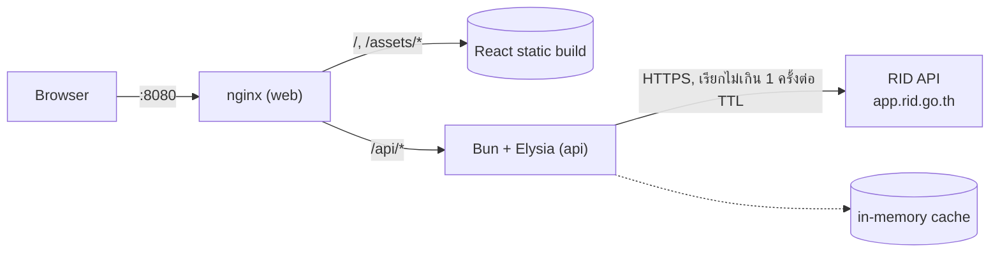
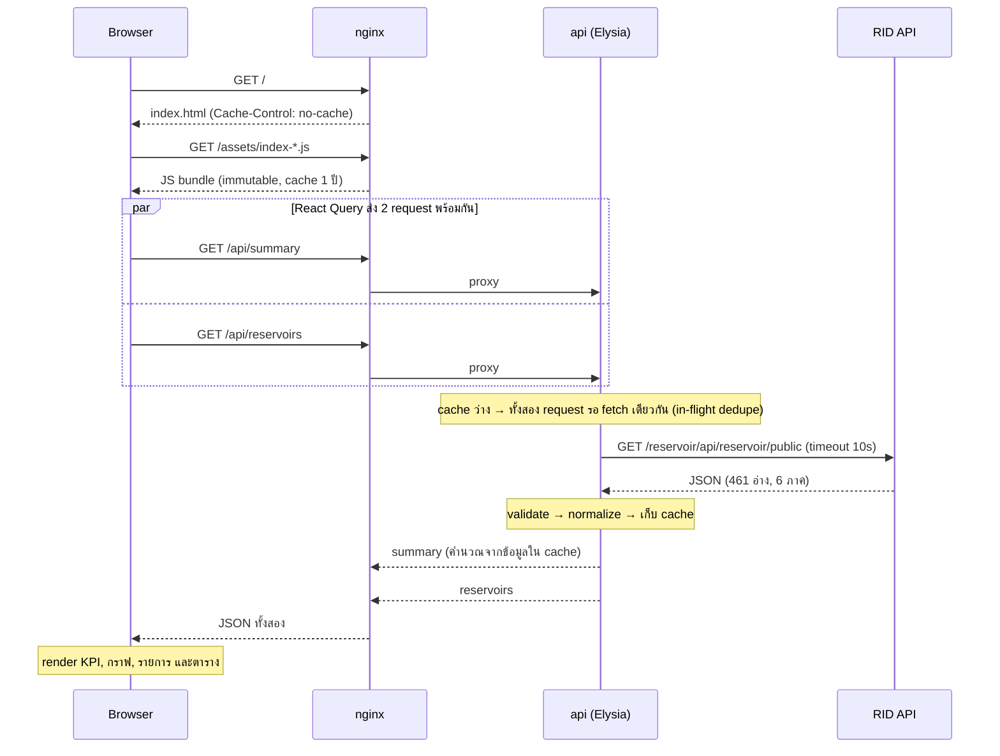

# 01 · ภาพรวมระบบ

## ระบบนี้ทำอะไร

Dashboard แสดงปริมาณน้ำในอ่างเก็บน้ำ 461 แห่งทั่วประเทศไทย โดยใช้ข้อมูลรายวันจาก API สาธารณะของกรมชลประทาน
ผู้ใช้เห็นภาพรวมทั้งประเทศ เปรียบเทียบรายภาค ดูอ่างที่น้ำน้อยหรือน้ำเกินความจุ และค้นหาอ่างแต่ละแห่งได้

สิ่งที่ระบบ**ไม่ได้**ทำ:
- **ไม่มีแผนที่** เพราะ API ไม่มีพิกัด และการหาพิกัดจากชื่ออ่างให้ผลไม่น่าเชื่อถือ (ดู [02](02-data-source.md#8-ไม่มีพิกัด))
- **ไม่มีข้อมูลย้อนหลัง** เพราะ API ให้แค่ข้อมูลวันล่าสุด

## ส่วนประกอบ



| ส่วน | เทคโนโลยี | หน้าที่ | โค้ด |
|---|---|---|---|
| **web** | nginx | serve ไฟล์ React ที่ build แล้ว และส่งต่อ `/api/*` ไปให้ api | `nginx/`, `frontend/Dockerfile` |
| **frontend** | React, Vite, Recharts, TanStack Table/Query | UI ของ dashboard ทั้งหมด ทำงานในเบราว์เซอร์ | `frontend/src/` |
| **api** | Bun, Elysia, TypeBox | ดึงข้อมูลจาก RID, ตรวจสอบ, ทำความสะอาด, คำนวณ และ cache | `backend/src/` |
| **RID API** | ภายนอก | แหล่งข้อมูล | – |

ตอนรันจริงมีแค่ 2 container คือ `web` กับ `api` การ build React เป็นขั้นหนึ่งใน Dockerfile ของ `web` ไม่ได้เป็น container แยก

## หลักการออกแบบสำคัญ

1. **Browser ไม่เรียก RID โดยตรง** ทุกอย่างผ่าน backend ซึ่งเลี่ยงปัญหา CORS ได้ และ RID จะถูกเรียกไม่เกิน 1 ครั้งต่อ 30 นาที ไม่ว่าจะมีผู้ใช้กี่คน
2. **Backend คำนวณ ส่วน frontend แสดงผล** ตัวเลขทั้งหมดที่เป็นตรรกะทางธุรกิจ เช่น % ของภาค, ระดับสถานะ และน้ำใช้การได้ คำนวณที่ backend ที่เดียว frontend ไม่ต้องรู้เกณฑ์ตัวเลข
3. **"ไม่มีข้อมูล" ไม่เท่ากับ 0** ค่า `null` จาก RID จะคงเป็น `null` ไปจนถึง UI และแสดงเป็น "ไม่มีข้อมูล" ไม่ถูกแปลงเป็น 0
4. **ระบบต้องไม่ล่มเพราะ RID ล่ม** ถ้ามีข้อมูลเก่าใน cache ระบบจะใช้ข้อมูลเก่าพร้อมแจ้งผู้ใช้ ถ้าไม่มีจะตอบ 503 อย่างชัดเจน
5. **Record ที่ผิดรูปแบบหนึ่งแถวต้องไม่ทำให้ทั้งหน้าพัง** record ที่ตรวจไม่ผ่านจะถูกข้ามและบันทึก log ไว้

## เส้นทางของ request ตั้งแต่ต้นจนจบ

ตัวอย่างนี้คือกรณีผู้ใช้เปิดหน้าเว็บครั้งแรก และ cache ใน backend ว่างอยู่



ภายใน 30 นาทีหลังจากนั้น ทุก request ไปที่ `/api/*` จะได้คำตอบจาก cache ทันทีโดยไม่เรียก RID

## โครงสร้างโฟลเดอร์

```
backend/     API (Bun + Elysia)              → 04-backend.md
frontend/    Dashboard (React)                → 05-frontend.md
nginx/       config ของ reverse proxy        → 06-infrastructure.md
e2e/         Playwright + mock RID            → 07-testing.md
docs/        เอกสารชุดนี้
docker-compose.yml        stack สำหรับ production
docker-compose.test.yml   override สำหรับ integration test
```
