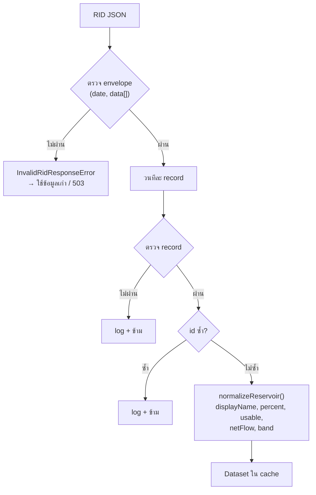

# 02 · แหล่งข้อมูล: RID API

## Endpoint

| | |
|---|---|
| ข้อมูล | `GET https://app.rid.go.th/reservoir/api/reservoir/public` |
| เอกสาร | https://app.rid.go.th/reservoir/api/document/reservoir |
| Authentication | ไม่ต้องใช้ |
| ขนาด response | ประมาณ 116 KB |
| ความถี่ที่ข้อมูลอัปเดต | ยังไม่ทราบแน่ชัด น่าจะวันละครั้ง (`date` เป็นวันที่ของข้อมูล) |

ตั้งค่า URL ได้ด้วย env `RID_API_URL` ซึ่งใช้ตอน test เพื่อชี้ไปที่ mock

## รูปแบบข้อมูล

```
{
  document: string,          // URL เอกสาร (ไม่ได้ใช้)
  date: "YYYY-MM-DD",        // วันที่ของข้อมูล
  total: number,             // จำนวนอ่าง
  data: [
    {
      region: "ภาคเหนือ",
      reservoir: [
        { id, name, storage, dead_storage, volume, percent_storage, inflow, outflow }
      ]
    }
  ]
}
```

| ฟิลด์ | ความหมาย | หน่วย | เป็น null ได้ |
|---|---|---|---|
| `storage` | ความจุของอ่าง (ระดับเก็บกัก) | ล้าน ลบ.ม. | ไม่ |
| `dead_storage` | น้ำก้นอ่างที่ใช้การไม่ได้ | ล้าน ลบ.ม. | ไม่ |
| `volume` | ปริมาณน้ำปัจจุบัน | ล้าน ลบ.ม. | **ได้** |
| `percent_storage` | `volume / storage × 100` | % | ได้ (ตามสเปก) |
| `inflow` | น้ำไหลเข้า | ล้าน ลบ.ม. (ยังไม่ทราบหน่วยเวลา) | **ได้ (116 อ่าง)** |
| `outflow` | น้ำระบาย | ล้าน ลบ.ม. (ยังไม่ทราบหน่วยเวลา) | **ได้ (191 อ่าง)** |

ข้อมูลวันที่ 2026-10-03 มี 6 ภาค: ภาคเหนือ (92), ภาคตะวันออกเฉียงเหนือ (234), ภาคตะวันออก (54), ภาคกลาง (28), ภาคตะวันตก (9), ภาคใต้ (44)

## ความผิดปกติของข้อมูลและวิธีจัดการ

พบทั้งหมดนี้จากการวิเคราะห์ข้อมูลจริง และแต่ละข้อมี test ครอบไว้

### 1. `volume` เป็น `null` แต่ `percent_storage` เป็น `0` ⚠️ สำคัญที่สุด

```json
{ "id": "rsv524", "storage": 5, "volume": null, "percent_storage": 0, ... }
```
วันที่ 2026-10-03 มี 6 อ่างที่เป็นแบบนี้ ถ้าเชื่อค่า `0` ตรงๆ อ่างเหล่านี้จะถูกจัดเป็น "น้ำน้อยวิกฤต" และทำให้ % ของภาคต่ำกว่าความจริง

**วิธีจัดการ:** ถ้า `volume` เป็น null จะไม่สนใจ `percent_storage` เลย และตั้ง `percent = null` กับ `band = "nodata"` ส่วนตอนคำนวณระดับภาค อ่างนี้จะนับอยู่ใน `count` แต่ไม่ถูกรวมใน `volume` และ `reportingStorage` (ดู [03](03-metrics-and-bands.md))

### 2. `inflow` / `outflow` เป็น `null`

**วิธีจัดการ:** คงเป็น `null` ตลอดทาง `netFlow` จะเป็น `null` ถ้าค่าใดค่าหนึ่งเป็น null ส่วน UI จะแสดงว่า "ไม่มีข้อมูล" และในตารางค่า null จะถูกเรียงไว้ท้ายเสมอ

### 3. เปอร์เซ็นต์เกิน 100%

อ่างเก็บน้ำ บึงละหาน (`rsv545`) มี `volume` 45.68 จาก `storage` 25 คิดเป็น **182.72%** วันนั้นมีอ่างที่เกิน 100% รวม 113 อ่าง

**วิธีจัดการ:** ไม่ตัดเพดานที่ 100 แต่มีระดับสถานะแยกเป็น `over` (เกินความจุ)

### 4. ชื่ออ่างซ้ำกัน

"อ่างเก็บน้ำห้วยทราย" มีหลายอ่าง (`rsv112`, `rsv135`, `rsv155`, `rsv180`, `rsv412`) "แม่ธิ" กับ "ห้วยยาง" ก็ซ้ำเหมือนกัน

**วิธีจัดการ:** ใช้ `id` เป็น key ทุกที่ ทั้ง React key, row id ของตาราง และการ dedupe UI แสดงรหัสกับภาคไว้ข้างชื่อเสมอ

### 5. เว้นวรรคในชื่อไม่สม่ำเสมอ

`"อ่างเก็บน้ำ แม่สะลวม"` กับ `"อ่างเก็บน้ำแม่ตูบ"`

**วิธีจัดการ:** ฟังก์ชัน `cleanName()` ใน `backend/src/normalize.ts` จะตัดช่องว่างหัวท้าย ยุบช่องว่างที่ซ้ำ และต่อคำว่า "อ่างเก็บน้ำ" เข้ากับชื่อ ผลที่ได้คือ `displayName` ส่วน `name` ดิบยังเก็บไว้ และแสดงใน drawer ถ้าต่างจาก `displayName` การค้นหาฝั่ง frontend ตัดช่องว่างออกทั้งหมดก่อนเทียบ

### 6. `id` ไม่เรียงลำดับ

`rsv531` อยู่ระหว่าง `rsv11` กับ `rsv13` และเลขข้ามไปหลายช่วง

**วิธีจัดการ:** ไม่มีโค้ดส่วนไหนสมมติว่า id เรียงกันหรือต่อเนื่อง

### 7. `dead_storage` เป็น 0 หรือมากกว่า `volume`

`rsv137` และ `rsv522` มี dead storage = 0 ส่วน `rsv181` มี volume 3.85 น้อยกว่า dead storage 4.31

**วิธีจัดการ:** น้ำใช้การได้ = `max(volume − dead_storage, 0)` จึงไม่ติดลบ และมีการป้องกันการหารด้วยศูนย์ทุกจุด

### 8. ไม่มีพิกัด

API ไม่มี lat/lng เราเคยทดสอบหาพิกัดจากชื่อแล้ว ผลคือ:
- **Google Maps URL:** ได้หน้า JavaScript ที่ไม่มีพิกัดใน HTML และการ scrape ผิดข้อตกลงการใช้งาน
- **OSM Nominatim:** ถูก 1 จาก 5 ชื่อ ที่เหลือได้อ่างผิดแห่งโดยไม่มีอะไรเตือน
- **OSM Overpass:** ทั้งประเทศมีอ่างที่ใส่ชื่อไว้แค่ 520 แห่ง จับคู่ได้ 5 จาก 12 ชื่อ และบางชื่อจับคู่ผิด
- **ThaiWater API:** มีพิกัดเฉพาะเขื่อนใหญ่ 35 แห่ง ไม่มีอ่างขนาดกลาง

**ข้อสรุป:** โปรเจกต์นี้จึงเป็น dashboard ไม่ใช่แผนที่ ถ้าในอนาคตมีแหล่งพิกัดทางการที่ใช้ `id` เดียวกัน ค่อยเพิ่มมุมมองแผนที่

## ขั้นตอนประมวลผลข้อมูล



โค้ด: `backend/src/schema.ts` (TypeBox schema) และ `backend/src/normalize.ts`

`total` ที่ backend ส่งออกไปคือจำนวนอ่างที่ผ่านการตรวจแล้ว ไม่ใช่ค่า `total` ดิบจาก RID
