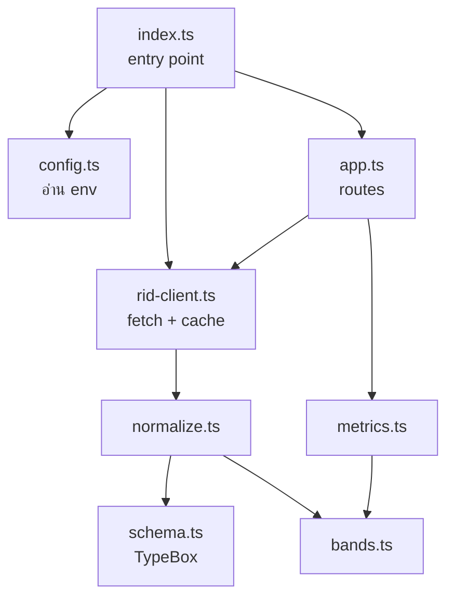
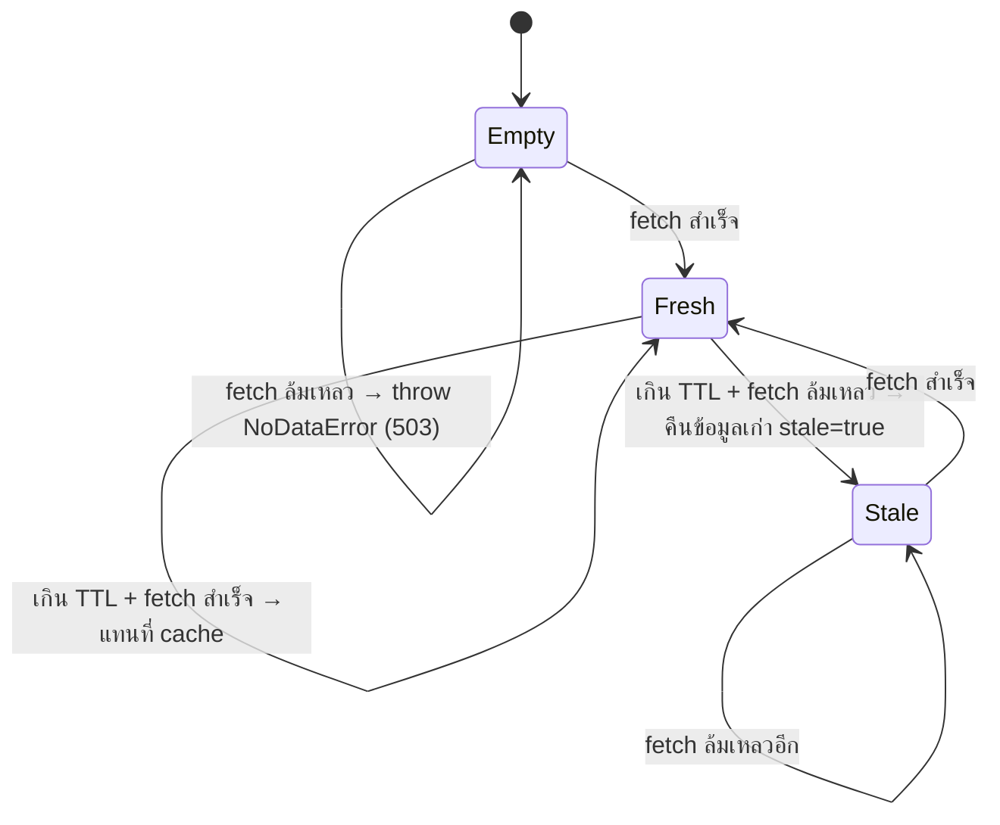

# 04 · Backend (Bun + Elysia)

## Module



| ไฟล์ | หน้าที่ | มี side effect ไหม |
|---|---|---|
| `index.ts` | ประกอบทุกส่วนเข้าด้วยกันแล้ว `listen` | ✅ (เป็นไฟล์เดียวที่มี) |
| `config.ts` | อ่านและตรวจ env ถ้าค่าผิดจะ throw ตั้งแต่ตอนเริ่ม | – |
| `rid-client.ts` | เรียก RID, timeout, cache, ใช้ข้อมูลเก่าเมื่อ RID ล่ม และรวม request ที่มาพร้อมกัน | เรียก network ผ่าน `fetch` ที่ฉีดเข้ามาได้ |
| `schema.ts` | TypeBox schema ของ response จาก RID | – |
| `normalize.ts` | ตรวจ, ทำความสะอาด และคำนวณฟิลด์รายอ่าง | – |
| `bands.ts` | เกณฑ์ระดับสถานะ | – |
| `metrics.ts` | รวมยอดทั้งประเทศและรายภาค | – |
| `app.ts` | สร้าง Elysia app จาก `RidSource` ที่ส่งเข้ามา | – |

**ทุก module ยกเว้น `index.ts` เป็น pure function หรือรับ dependency ผ่าน parameter** ทำให้ test ได้โดยไม่ต้องใช้ network จริง
เช่น `createApp(source)` รับอะไรก็ได้ที่มี method `get()` และ `createRidSource()` รับ `fetch` กับ `now` ที่ปลอมได้

## Cache และการใช้ข้อมูลเก่า (`rid-client.ts`)



รายละเอียดที่ควรรู้:

- **TTL:** ค่าเริ่มต้น 1,800 วินาที (`CACHE_TTL_SECONDS`) นับจากเวลาที่ fetch **สำเร็จ**ครั้งล่าสุด
- **รวม request ที่มาพร้อมกัน:** ถ้ามีหลาย request ระหว่างที่กำลัง fetch ทุกตัวจะรอ promise เดียวกัน (`inFlight`) จึงไม่ยิงซ้ำไปที่ RID
- **Timeout:** 10,000 ms (`RID_TIMEOUT_MS`) ใช้ `AbortSignal.timeout`
- **กรณีที่นับว่าล้มเหลว:** network error, timeout, HTTP ที่ไม่ใช่ 2xx, JSON ที่ parse ไม่ได้ และ envelope ที่ตรวจไม่ผ่าน
- **`fetchedAt`** คือเวลาที่ fetch สำเร็จครั้งล่าสุด ตอนใช้ข้อมูลเก่า ค่านี้จะเป็นเวลาเก่า ทำให้ผู้ใช้รู้ว่าข้อมูลมาจากเมื่อไหร่
- **Cache อยู่ในหน่วยความจำของ process** ถ้า restart container cache จะหายไป และถ้ารันหลาย instance แต่ละตัวมี cache ของตัวเอง

> ⚠️ **ข้อจำกัดที่รู้อยู่:** ระหว่างที่ RID ล่ม `fetchedAt` จะไม่ถูกอัปเดต request ทุกครั้งหลังเกิน TTL จึงพยายามเรียก RID ใหม่
> และอาจต้องรอนานถึง `RID_TIMEOUT_MS` ก่อนได้ข้อมูลเก่า (request ที่มาพร้อมกันยังรอ fetch เดียวกันอยู่) ทางแก้คือเพิ่ม backoff ดู [08-operations.md](08-operations.md)

## API

Route ทั้งหมดอยู่ใต้ `/api` (Elysia `prefix`)

### `GET /api/health`
```json
{ "status": "ok" }
```
ตอบทันทีโดยไม่ดูสถานะของ RID Docker healthcheck ใช้ endpoint นี้

### `GET /api/summary`
```jsonc
{
  "date": "2026-10-03",              // วันที่ของข้อมูลจาก RID
  "fetchedAt": "2026-10-03T08:15:00.000Z",
  "stale": false,
  "total": 461,
  "national": { /* GroupStats */ },
  "regions": [ { "region": "ภาคเหนือ", /* GroupStats */ } ]  // เรียงตามลำดับที่ RID ส่งมา
}
```
ความหมายของแต่ละฟิลด์ดูได้ใน [03-metrics-and-bands.md](03-metrics-and-bands.md) ระบบคำนวณใหม่ทุก request จากข้อมูลใน cache ซึ่งเร็วมากเพราะมีแค่ 461 แถว

### `GET /api/reservoirs`
```jsonc
{
  "date": "...", "fetchedAt": "...", "stale": false, "total": 461,
  "reservoirs": [
    {
      "id": "rsv545", "name": "อ่างเก็บน้ำ บึงละหาน", "displayName": "อ่างเก็บน้ำบึงละหาน",
      "region": "ภาคตะวันออกเฉียงเหนือ",
      "storage": 25, "deadStorage": 7.5, "volume": 45.68, "percent": 182.72, "usable": 38.18,
      "inflow": 2.16, "outflow": null, "netFlow": null, "band": "over"
    }
  ]
}
```
ส่งทั้งหมดในครั้งเดียว ไม่มี pagination หรือ filter ฝั่ง server เพราะข้อมูลมีขนาดเล็ก การกรองและเรียงทำที่ client

### Error

| สถานการณ์ | Status | Body |
|---|---|---|
| RID ล่มและ cache ว่าง | 503 | `{ "error": "RID data is currently unavailable" }` |
| RID ล่มแต่มี cache | 200 | ข้อมูลปกติ แต่ `stale: true` |
| path ที่ไม่มีอยู่ | 404 | ใช้ค่าเริ่มต้นของ Elysia |

`NoDataError` ถูกลงทะเบียนกับ Elysia ด้วย `.error({ NoDataError })` แล้วแปลงเป็น 503 ใน `onError`

## Configuration

| Env | ค่าเริ่มต้น | ตรวจ |
|---|---|---|
| `RID_API_URL` | `https://app.rid.go.th/reservoir/api/reservoir/public` | – |
| `CACHE_TTL_SECONDS` | `1800` | ต้องเป็นจำนวนเต็มบวก |
| `RID_TIMEOUT_MS` | `10000` | ต้องเป็นจำนวนเต็มบวก |
| `API_PORT` | `3000` | ต้องเป็นจำนวนเต็มบวก |

ถ้าค่าไม่ถูกต้อง process จะหยุดทันทีตอนเริ่ม พร้อมข้อความที่บอกชื่อตัวแปร

## คำสั่ง

```bash
cd backend
bun install
bun run dev         # watch mode, :3000
bun run start       # production mode
bun test            # unit test
bun run typecheck   # tsc --noEmit
```

## การเพิ่ม endpoint ใหม่

1. เพิ่ม route ใน `createApp()` (`app.ts`) โดยดึงข้อมูลจาก `source.get()` และใส่ `...meta(s)` ใน response เพื่อให้มี `date`, `fetchedAt` และ `stale`
2. ถ้ามีการคำนวณ ให้เขียนเป็น pure function ใน `metrics.ts` หรือ module ใหม่ แล้วเขียน unit test แยก
3. เพิ่ม test ระดับ route ใน `backend/test/app.test.ts` ทั้งกรณีปกติและกรณี 503
4. อัปเดต type ใน `frontend/src/types.ts` และ README §4.3
