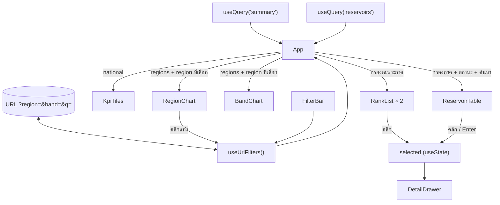

# 05 · Frontend (React)

## Stack

| | ใช้ทำอะไร |
|---|---|
| React 19 + TypeScript | UI |
| Vite | dev server (proxy `/api` ไป `:3000`) และ build |
| TanStack Query | ดึงข้อมูล, cache ฝั่ง client, refetch และสถานะ loading/error |
| TanStack Table v8 | ตาราง (เรียงได้) |
| Recharts v3 | กราฟแท่ง |
| CSS ธรรมดา (`styles.css`) | ใช้ design token ผ่าน CSS variable และรองรับโหมดมืดด้วย `prefers-color-scheme` |

## โครงสร้าง

```
frontend/src/
├── main.tsx              สร้าง QueryClient แล้ว render <App/>
├── App.tsx               ดึงข้อมูล, ถือ state ของตัวกรองและอ่างที่เลือก, จัด layout
├── api.ts                fetchSummary(), fetchReservoirs()
├── types.ts              type ที่ลอกจาก API contract ของ backend
├── styles.css
├── config/bands.ts       ป้าย, ไอคอน และสีของแต่ละระดับสถานะ
├── lib/
│   ├── format.ts         จัดรูปแบบตัวเลขและวันที่ (th-TH, พ.ศ.)
│   ├── filters.ts        ค้นหา, กรอง, จัดอันดับ และแปลงตัวกรองไปมากับ URL (pure function)
│   └── hooks.ts          useUrlFilters(), useColorScheme()
└── components/
    ├── Header.tsx        ชื่อหน้า, วันที่ข้อมูล และป้ายเตือนเมื่อข้อมูลไม่เป็นปัจจุบัน
    ├── KpiTiles.tsx      KPI 6 ช่อง (ทั้งประเทศ)
    ├── FilterBar.tsx     ภาค / สถานะ / ค้นหา / ล้างตัวกรอง
    ├── RegionChart.tsx   กราฟ % รายภาค (คลิกแท่งเพื่อกรองได้)
    ├── BandChart.tsx     กราฟแท่งซ้อนแสดงจำนวนอ่างตามสถานะ
    ├── RankList.tsx      รายการจัดอันดับ (ใช้ทั้ง "น้อยที่สุด" และ "เกินความจุ")
    ├── ReservoirTable.tsx ตารางอ่างทั้งหมด
    ├── DetailDrawer.tsx  แผงรายละเอียดของแต่ละอ่าง
    └── StatusBadge.tsx   ป้ายสถานะ (ไอคอน + ข้อความ)
```

## การไหลของข้อมูลและ state



### ตัวกรองมีผลกับส่วนไหนบ้าง

| ส่วน | ภาค | สถานะ | ค้นหา |
|---|---|---|---|
| KPI tiles | – (แสดงทั้งประเทศเสมอ) | – | – |
| กราฟรายภาค | ทำให้ภาคอื่นจางลง | – | – |
| กราฟจำนวนตามสถานะ | แสดงเฉพาะภาคที่เลือก | – | – |
| 10 อ่างที่น้ำน้อยที่สุด / เกินความจุ | ✅ | – | – |
| ตาราง | ✅ | ✅ | ✅ |

สถานะกับคำค้นหามีผลแค่กับตาราง เพราะรายการจัดอันดับมีเงื่อนไขของตัวเองอยู่แล้ว เช่น รายการเกินความจุก็คือสถานะ `over`

### ตัวกรองเก็บใน URL (`useUrlFilters`)

- อ่านค่าตั้งต้นจาก `window.location.search` และค่า `band` ที่ไม่รู้จักจะถูกข้ามไป
- ตอนค่าเปลี่ยนจะใช้ `history.replaceState` **ไม่ได้ใช้ `pushState`** เพื่อไม่ให้การพิมพ์ค้นหาแต่ละตัวอักษรกลายเป็น history หนึ่งรายการ ผลคือปุ่ม Back ของเบราว์เซอร์จะไม่ย้อนตัวกรองทีละขั้น
- ฟัง `popstate` ไว้ด้วย เผื่อมีการเปลี่ยน URL จากภายนอก
- แชร์ลิงก์เดียวกันแล้วได้มุมมองเดียวกัน เช่น `/?region=ภาคใต้&band=critical`

### การดึงข้อมูล (`main.tsx`)

| ตั้งค่า | ค่า | เหตุผล |
|---|---|---|
| `staleTime` | 5 นาที | ไม่ refetch ทุกครั้งที่สลับ tab |
| `refetchInterval` | 10 นาที | ถ้าเปิดค้างไว้ข้อมูลจะอัปเดตเอง (backend cache 30 นาที) |
| `retry` | 1 | ถ้า request ล้มเหลว ลองใหม่ 1 ครั้งแล้วแสดง error |

หน้าเว็บจะ render เมื่อ**ทั้งสอง query** สำเร็จ ถ้าตัวใดตัวหนึ่งล้มเหลวจะแสดงกล่อง error ที่มีปุ่ม "ลองใหม่"
ป้ายเตือนข้อมูลไม่เป็นปัจจุบันจะแสดงถ้า response ตัวใดตัวหนึ่งมี `stale: true`

## รายละเอียดของ component ที่ควรรู้

### ReservoirTable
- ค่าเริ่มต้นเรียงตาม `% ความจุ` จากน้อยไปมาก เพื่อให้อ่างที่น่ากังวลอยู่บนสุด
- คอลัมน์ตัวเลขแปลง `null` เป็น `undefined` แล้วใช้ `sortUndefined: "last"` เพื่อให้แถวที่ไม่มีข้อมูล**อยู่ท้ายเสมอทั้งสองทิศทาง**
- `enableSortingRemoval: false` ทำให้คลิกหัวตารางแล้วสลับระหว่างน้อยไปมากกับมากไปน้อยเท่านั้น ไม่กลับไปเป็นไม่เรียง (เคยเป็นบั๊กที่ test จับได้)
- ชื่ออ่างและภาคเรียงด้วย `Intl.Collator("th")` ส่วนสถานะเรียงตามลำดับระดับ ไม่ได้เรียงตามตัวอักษร
- แต่ละแถวกดได้ทั้งคลิกและคีย์บอร์ด (`tabIndex=0`, Enter, Space)
- แสดงทุกแถวโดยไม่แบ่งหน้า (461 แถว) และจำกัดความสูงไว้ที่ 640px โดยหัวตารางติดอยู่ด้านบนเสมอ

### RegionChart
- เรียงจาก % มากไปน้อย มีเส้นประอ้างอิงที่ 100%
- ใช้สีเดียวทุกแท่ง ภาคที่ไม่ได้เลือกจะจางลง (opacity 0.3)
- คลิกแท่งเพื่อเลือกภาค คลิกซ้ำเพื่อยกเลิก
- Tooltip แสดงปริมาณน้ำ ความจุ น้ำใช้การได้ และจำนวนอ่าง

### DetailDrawer
- เป็น dialog ที่มี `role="dialog"` และ `aria-modal` เมื่อเปิดจะย้าย focus ไปที่ปุ่มปิด
- ปิดได้ด้วย Esc, ปุ่ม ✕ หรือคลิกที่ backdrop
- แถบความจุวาดเส้นน้ำเก็บกักต่ำสุด (เส้นประ) และความจุ (เส้นทึบ) บนสเกลเดียวกับปริมาณน้ำ ถ้าน้ำเกินความจุ สเกลจะขยายตาม

## การจัดรูปแบบ (`lib/format.ts`)

| ฟังก์ชัน | ตัวอย่าง |
|---|---|
| `formatVolume` | `1234.567` → `1,234.57` |
| `formatPercent` | `182.72` → `182.7%` |
| `formatFlow` | `0.035` → `0.035` |
| `formatSignedFlow` | `0.3` → `+0.300` |
| `formatThaiDate` | `"2026-10-03"` → `3 ต.ค. 2569` |
| `formatThaiDateTime` | ISO → เวลากรุงเทพฯ (พ.ศ.) |
| ทุกฟังก์ชันเมื่อได้ `null` | `ไม่มีข้อมูล` |

`formatThaiDate` อ่านวันที่เป็น**วันในปฏิทิน** ไม่ได้แปลงเป็น timestamp ตาม timezone ของผู้ใช้ ทำให้ไม่เพี้ยนไปหนึ่งวัน
ส่วน locale ใช้ `th-TH-u-ca-buddhist` แบบระบุตรงๆ ผลจึงไม่ขึ้นกับ runtime

## Accessibility

- สถานะมีป้ายข้อความและไอคอนกำกับเสมอ ไม่ได้ใช้สีอย่างเดียว
- ช่องกรองผูก `<label for>` กับ input ทำให้โปรแกรมอ่านหน้าจออ่านแค่ชื่อช่อง
- ทุก section มี `aria-labelledby` ชี้ไปที่หัวข้อ
- ป้ายเตือนข้อมูลไม่เป็นปัจจุบันใช้ `role="status"` ส่วนกล่อง error ใช้ `role="alert"`
- **ข้อจำกัด:** การคลิกแท่งกราฟเพื่อกรองยังใช้ได้แค่กับเมาส์ ส่วนผู้ใช้คีย์บอร์ดใช้ dropdown ภาคแทนได้

## คำสั่ง

```bash
cd frontend
bun install
bun run dev         # :5173, proxy /api → :3000 (เปลี่ยนได้ด้วย env API_URL)
bun run build       # tsc -b แล้ว vite build ไปที่ dist/
bun run test        # vitest
bun run typecheck
```
