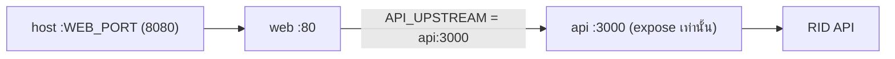

# 06 · Infrastructure: Docker, nginx และ Compose

## Docker images

### `api` (`backend/Dockerfile`)

```
stage deps:  oven/bun:1.3-alpine   → bun install --frozen-lockfile --production
final:       oven/bun:1.3-alpine   → copy node_modules + src
                                     USER bun (ไม่ใช้ root)
                                     HEALTHCHECK wget /api/health
                                     CMD bun src/index.ts
```
- ไม่มีขั้น build เพราะ Bun รัน TypeScript ได้โดยตรง
- `backend/.dockerignore` กัน `node_modules`, `test` และ `.env*` ไม่ให้เข้าไปใน image
- ขนาดประมาณ 192 MB

### `web` (`frontend/Dockerfile`)

```
stage build: oven/bun:1.3-alpine   → bun install → bun run build (tsc + vite)
final:       nginx:1.29-alpine     → copy dist/ + nginx template + security headers
```
- **Build context คือ root ของ repo** (`context: .` ใน compose) เพื่อให้ copy โฟลเดอร์ `nginx/` เข้าไปได้
- `.dockerignore` ที่ root กัน `node_modules`, `dist`, `.env*`, `backend` และ `e2e`
- ขนาดประมาณ 94 MB

## nginx (`nginx/default.conf.template`)

| Location | พฤติกรรม |
|---|---|
| `/api/` | `proxy_pass http://${API_UPSTREAM}` และส่ง header `Host`, `X-Forwarded-*` ต่อไป มี read timeout 30 วินาที |
| `/assets/` | ไฟล์ที่ชื่อมี hash จาก Vite ตั้ง cache 1 ปีแบบ `immutable` |
| `/` | `try_files $uri /index.html` (SPA fallback) และใช้ `Cache-Control: no-cache` เพื่อให้ได้ `index.html` ใหม่ทุกครั้งที่ deploy |

**การแทนค่า environment variable:** image `nginx` อย่างเป็นทางการจะรัน `envsubst` กับไฟล์ใน `/etc/nginx/templates/*.template` ตอนเริ่ม
และแทนเฉพาะตัวแปรที่มีอยู่ใน env จริง เช่น `API_UPSTREAM` ส่วน `$host` และ `$uri` ของ nginx จึงไม่ถูกแทนไปด้วย

**Security headers** (`nginx/security-headers.conf`): `X-Content-Type-Options`, `Referrer-Policy` และ `X-Frame-Options`

> ⚠️ ใน nginx ถ้า `location` ไหนมี `add_header` ของตัวเอง header ที่ตั้งไว้ระดับ `server` จะ**ไม่ถูกสืบทอด**ลงมา
> จึงต้อง `include` ไฟล์ security headers ซ้ำในทุก location ที่มี `add_header` เคยมีบั๊กจากเรื่องนี้ และตอนนี้มี e2e test ครอบอยู่

นอกจากนี้ยังเปิด gzip สำหรับ CSS, JS, JSON และ SVG และปิด `server_tokens` เพื่อไม่ให้เปิดเผยเวอร์ชันของ nginx

## Docker Compose

### `docker-compose.yml` (production)



- `api` ใช้ `expose` ไม่ได้ใช้ `ports` จึงเข้าถึงได้จากใน network ของ compose เท่านั้น
- `web` รอ `api` ให้ `service_healthy` ก่อนเริ่ม
- ทั้งสอง service ตั้ง `restart: unless-stopped`

### `docker-compose.test.yml` (override สำหรับ integration test)

เพิ่ม service `mock-rid` ซึ่งเป็น Bun ที่รัน `e2e/mock-rid.ts` และ serve ไฟล์ fixture ที่ mount เข้าไปแบบ read-only
แล้วเปลี่ยน `RID_API_URL` ของ `api` ให้ชี้ไปที่ `http://mock-rid:4000/` ทำให้ integration test **ไม่เรียก RID จริงเลย**

```bash
docker compose -f docker-compose.yml -f docker-compose.test.yml up -d --build
```

## Environment variables

| ตัวแปร | ใช้ที่ | ค่าเริ่มต้น | หมายเหตุ |
|---|---|---|---|
| `RID_API_URL` | api | URL ของ RID | |
| `CACHE_TTL_SECONDS` | api | `1800` | |
| `RID_TIMEOUT_MS` | api | `10000` | |
| `API_PORT` | api, web | `3000` | web ใช้ค่านี้ประกอบเป็น `API_UPSTREAM` |
| `WEB_PORT` | compose | `8080` | port ฝั่ง host |
| `API_UPSTREAM` | web | `api:3000` | compose ตั้งให้อัตโนมัติ |

ทุกตัวมีค่าเริ่มต้นใน compose แล้ว ไฟล์ `.env` จึงไม่จำเป็น ถ้าจะเปลี่ยนค่า ให้ copy จาก `.env.example`
ระบบนี้**ไม่มี secret** เพราะ RID API เป็นสาธารณะ

## Deploy ที่อื่น

| เป้าหมาย | วิธี |
|---|---|
| VPS หรือ server ที่มี Docker | `git clone` แล้ว `docker compose up -d --build` ควรมี reverse proxy หรือ TLS (เช่น Caddy, Traefik) อยู่ข้างหน้า |
| Render / Fly.io / Railway | ใช้ Dockerfile เดิมได้ทั้งสองตัว |
| Vercel | **ใช้ Docker และ nginx ไม่ได้** ต้องแปลง backend เป็น serverless function และใช้ CDN cache แทน in-memory cache ยังไม่ได้ทำ ดู [08-operations.md](08-operations.md) |
