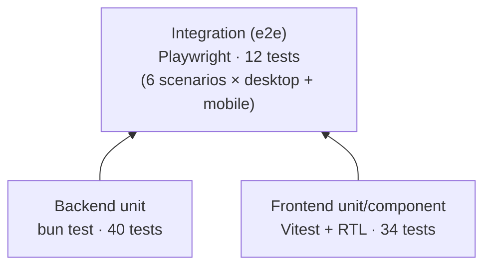

# 07 · การทดสอบ

## ภาพรวม



| ระดับ | เครื่องมือ | ทดสอบอะไร | เรียก RID จริงไหม |
|---|---|---|---|
| Backend unit | `bun test` | normalize, metrics, bands, cache, routes และ config | ❌ |
| Frontend unit/component | Vitest + React Testing Library (jsdom) | format, filter, component และ App ทั้งหน้า (mock `fetch`) | ❌ |
| Integration | Playwright (Chromium) | stack จริงผ่าน nginx | ❌ ใช้ mock RID |

**หลักการ:** test ทั้งหมดต้องไม่เรียก RID จริง ผลจะได้แน่นอนทุกครั้ง และรันได้แม้ RID ล่ม

## Fixture

`backend/test/fixtures/rid-2026-10-03.json` คือ response จริงจาก RID ทั้งไฟล์ (461 อ่าง) ใช้ที่:
- backend test (`helpers.ts` → `fixture()`) เพื่อตรวจว่าข้อมูลจริงผ่านทุก edge case
- mock RID ตอนรัน integration test

การทดสอบ edge case เฉพาะจุดใช้ builder ตัวเล็ก ได้แก่ `rsv()` และ `ridResponse()` ใน `backend/test/helpers.ts`
ฝั่ง frontend ใช้ `reservoir()`, `summaryResponse()` และ `reservoirsResponse()` ใน `frontend/test/data.ts`

### เพิ่ม fixture ใหม่

```bash
curl -s https://app.rid.go.th/reservoir/api/reservoir/public \
  -o backend/test/fixtures/rid-$(date +%F).json
```
ควรเพิ่มเมื่อเจอข้อมูลรูปแบบใหม่จาก RID แล้วเขียน test ที่อ้างถึงกรณีนั้นโดยตรง
ส่วน fixture เดิมไม่ควรลบหรือแก้ เพราะ test หลายตัวอ้างถึงตัวเลขในไฟล์นั้น

## Backend (`backend/test/`)

| ไฟล์ | ครอบคลุม |
|---|---|
| `bands.test.ts` | ทุกขอบของระดับสถานะ (30, 30.01, 50, … 100.01) และ null หรือ NaN |
| `normalize.test.ts` | `cleanName`, ค่า null ทั้งหมด, ค่าเกิน 100%, กรณี volume null แต่ % เป็น 0, usable ที่ต้องไม่ติดลบ, envelope ที่ผิด, record ที่ผิดหรือซ้ำ และ fixture จริง |
| `metrics.test.ts` | ใช้ผลรวมแทนค่าเฉลี่ย, อ่างที่ไม่มีข้อมูลไม่ถูกรวมใน % และยอดรวมรายภาคต้องเท่ากับทั้งประเทศ |
| `rid-client.test.ts` | TTL, หมด TTL แล้ว refetch, ข้อมูลเก่าเมื่อ HTTP 500 หรือ body ผิด, `NoDataError` และการรวม request ที่มาพร้อมกัน |
| `app.test.ts` | ทุก route, รูปแบบ response และ 503 |
| `config.test.ts` | ค่าเริ่มต้น, การ override และค่าที่ไม่ถูกต้อง |

เทคนิคที่ใช้: `createRidSource` รับ `fetch` และ `now` ที่ปลอมได้ จึงทดสอบ TTL ได้โดยเลื่อนนาฬิกาเอง ไม่ต้องรอเวลาจริง
ส่วน `createApp` ทดสอบด้วย `app.handle(new Request(...))` ได้โดยไม่ต้องเปิด port

## Frontend (`frontend/test/`)

| ไฟล์ | ครอบคลุม |
|---|---|
| `format.test.ts` | ตัวเลข th-TH, ปี พ.ศ., เวลากรุงเทพฯ และ null ที่ต้องเป็น "ไม่มีข้อมูล" |
| `filters.test.ts` | ค้นหาโดยไม่สนช่องว่างและตัวพิมพ์, ตัวกรองที่ใช้ร่วมกัน, การจัดอันดับ และแปลงไปมากับ URL |
| `components.test.tsx` | Badge, Header (ป้ายข้อมูลไม่เป็นปัจจุบัน), KPI, การเรียงตาราง (null อยู่ท้ายทั้งสองทิศ), คีย์บอร์ด และ Drawer |
| `App.test.tsx` | ทั้งหน้า: loading → แสดงผล, error + ลองใหม่, ข้อมูลไม่เป็นปัจจุบัน, ตัวกรองภาคมีผลกับทุกส่วน, ตัวกรองจาก URL และเปิด drawer |

`test/setup.ts` เพิ่ม `ResizeObserver` และ `matchMedia` ปลอม (jsdom ไม่มีให้) และล้าง URL หลังแต่ละ test
กราฟ Recharts ไม่ render เป็นรูปจริงใน jsdom ส่วนนี้จึงไม่ตรวจภาพของกราฟ แต่ตรวจหัวข้อและ legend แทน

## Integration (`e2e/`)

| Test | ตรวจ |
|---|---|
| nginx serves the app and proxies the API | `/` ได้ HTML, `/api/health` และ `/api/summary` ผ่าน proxy |
| nginx sets security and cache headers | `nosniff` ทุก location, `no-cache` ที่ `/` และ `immutable` ที่ `/assets` |
| unknown client routes fall back to the app | SPA fallback |
| dashboard renders with data and no console errors | 461 แถว, ไม่มี console error และไม่มี scroll แนวนอน (สำคัญบนมือถือ) |
| region filter updates every section and the URL | ตัวกรองมีผลกับทุกส่วน, URL เปลี่ยนตาม และ reload แล้วค่ายังอยู่ |
| clicking a table row opens the detail drawer | ค้นหา → คลิก → drawer → Esc |

ทุก test รัน 2 แบบ คือ `desktop` (Desktop Chrome) และ `mobile` (Pixel 7)

### วิธีรัน

```bash
# 1) เปิด stack ที่ใช้ mock RID
docker compose -f docker-compose.yml -f docker-compose.test.yml up -d --build

# 2) รัน test
cd e2e
bun install
bunx playwright install chromium   # ครั้งแรกเท่านั้น
bun run test:e2e

# 3) ปิด stack
cd .. && docker compose -f docker-compose.yml -f docker-compose.test.yml down
```

ถ้าจะรันกับ dev server โดยไม่ใช้ Docker:
```bash
bun e2e/mock-rid.ts &                                          # :4000
(cd backend && RID_API_URL=http://localhost:4000/ bun run dev) &
(cd frontend && bun run dev) &
cd e2e && BASE_URL=http://localhost:5173 bun run test:e2e
```
test เรื่อง header ของ nginx จะไม่ผ่านในโหมดนี้ เพราะ Vite ไม่ได้ส่ง header เหล่านั้น

ถ้า test ล้มเหลว Playwright จะเก็บ trace ไว้ที่ `e2e/test-results/` เปิดดูด้วย `bunx playwright show-trace <file>`

## รัน test ทั้งหมด

```bash
(cd backend && bun test && bun run typecheck) && \
(cd frontend && bun run test && bun run typecheck) && \
docker compose -f docker-compose.yml -f docker-compose.test.yml up -d --build && \
(cd e2e && bun run test:e2e); \
docker compose -f docker-compose.yml -f docker-compose.test.yml down
```

> ยังไม่มี CI (GitHub Actions) test จึงรันได้แค่ในเครื่อง ดู [08-operations.md](08-operations.md)

## กติกาเมื่อเพิ่มฟีเจอร์ (ตาม CLAUDE.md)

1. ตรรกะใหม่ใน backend ต้องมี unit test ครอบทั้งกรณีปกติและ edge case จากข้อมูลจริง
2. component ใหม่ต้องมี test ใน `components.test.tsx` หรือไฟล์ของตัวเอง
3. พฤติกรรมที่ผู้ใช้เห็นข้ามหลายส่วน เช่น ตัวกรองที่มีผลหลายที่ ต้องมี test ใน `App.test.tsx` หรือ e2e
4. ถ้าแก้ nginx หรือ compose ต้องรัน e2e กับ Docker stack ก่อน merge
